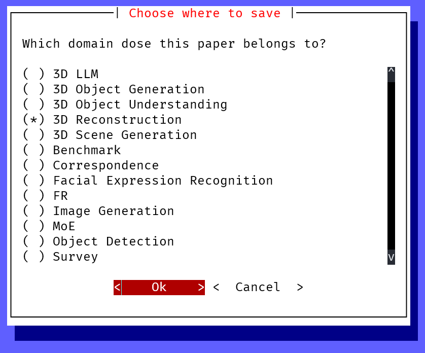

# Introduction
This tool provide a pipeline that can help you download PDF(s), merge them into a single file and rename it based on the venue, title and authors.

# Usage
1. Write `config.json` at `${HOME}/.config/paper-down/config.json` with the following format:

```json
{
  "temp_filename_1": "__TEMP__1.pdf",
  "temp_filename_2": "__TEMP__2.pdf",
  "temp_filename": "__TEMP__.pdf",
  "save_root": REPLACE_WITH_YOUR_ROOT
}
```

2. Note that the `save_root` property is where PDFs save, such as `/home/user/documents/papers/`.
In this directory, it should contain some directories like:
```plaintext
YOUR_ROOT
├── LLM
├── Image Generation 
├── 3D Reconstruction
├── Face Recognition
├── ...
```

3. Install `paper-downloader`:

```bash
pip install paper-downloader
```

4. Start!

```bash
pd
```

5. Input information


- First URL (required): The PDF URL
- Second URL (optional): Usually supplemental materials
- Title: Paper title
- Author name: Author's name
- Venue: venue

6. Choose Location



Choose a location that you want to save to based on the `config.json` file you created.

7. Confirm


Conform your inputs and choice.
